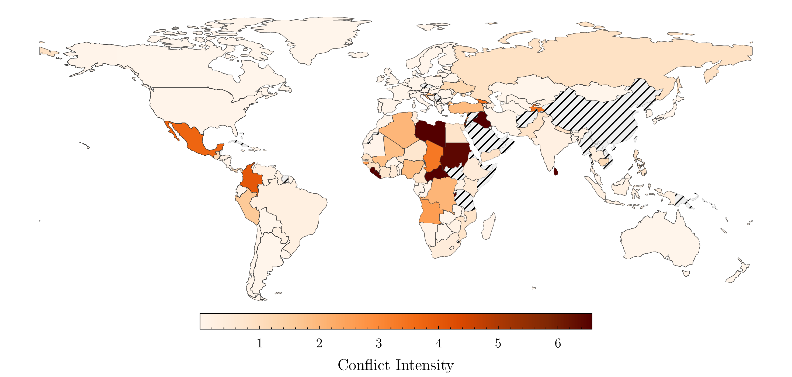
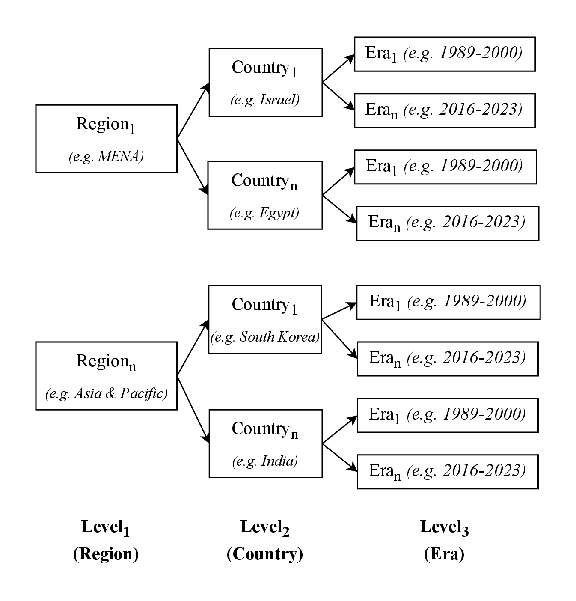
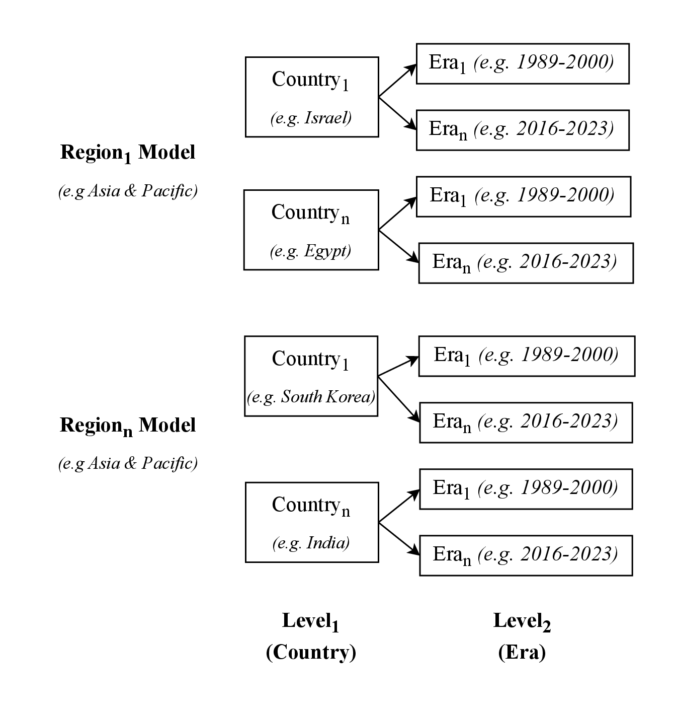
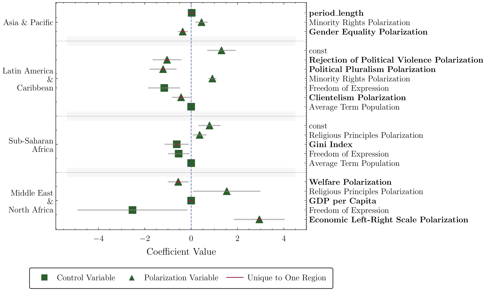
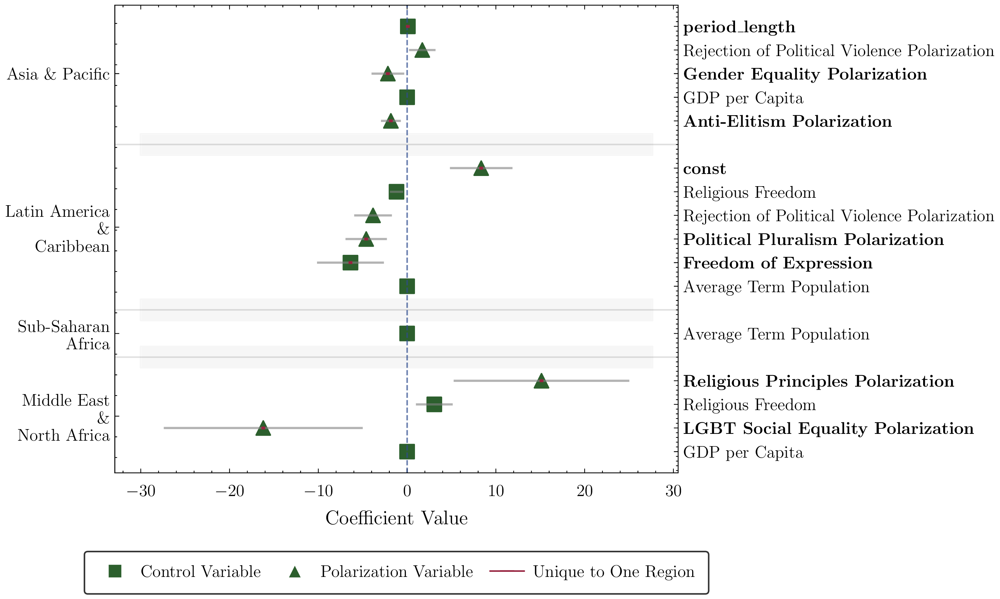
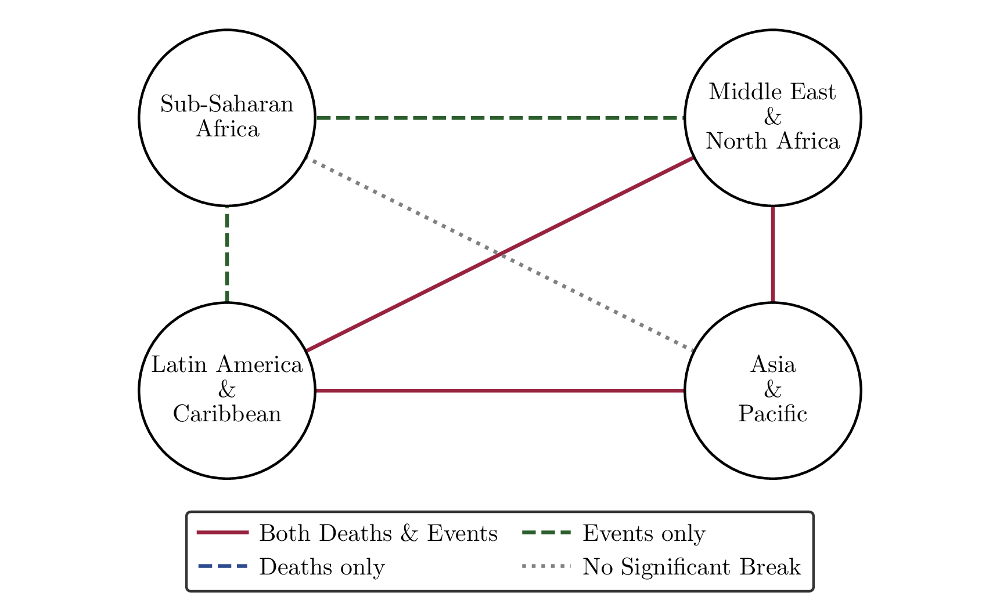

# Party Ideologies and Political Polarization-Driven Conflicts: A Study of the Global South

<p align="center">
  <a href="https://www.arxiv.org/abs/2506.02004">
    
  </a>
  &nbsp;
  <a href="## Citation">
    
  </a>
</p>


This repository contains the code and data for the paper "Party Ideologies and Political Polarization-Driven Conflicts: A Study of the Global South".

<p align="center">
  
  <br>
  <em><strong>Figure 1:</strong> World Map of Conflict Related Death Rate. A visual depiction of the global distribution of conflict-related deaths (1989–2023), normalized per 100,000 population and regime duration. The map reveals substantially higher conflict intensity in the Global South, particularly across Africa and parts of Latin America.</em>
</p>

## Abstract

This study examines how political identity-induced polarization affects armed conflicts in Global South regions. Using polarization indices based on party stances from the V-Party Dataset and conflict data from UCDP, we analyze the relationship between political fragmentation and violence across four regions: Middle East & North Africa, Sub-Saharan Africa, Latin America & Caribbean, and Asia & Pacific.

**Key Findings:**
- Regional structural breaks exist between regions in polarization-conflict dynamics  
- Religious Principles and Minority Rights polarization strongly predict conflict  
- Different types of polarization affect different regions uniquely  
- Mixed-effects modeling reveals significant country and era-level effects  

## Repository Structure

```
.
├── data_prep.ipynb           # Data preparation and polarization index creation
├── modelling.ipynb           # Mixed effects modeling and Chow's tests
├── visualisations.ipynb      # Results visualization and robustness checks
├── data/                     # Raw and processed datasets
├── src/                      # Helper functions for analysis
└── assets/figs/             # Generated figures and plots
```

## Data Sources

- **Political Identities**: V-Party Dataset (V-Dem Project) - party stances and ideologies  
- **Conflicts**: Uppsala Conflict Data Program (UCDP) - georeferenced conflict events  
- **Controls**: World Bank (GDP, Gini), V-Dem (freedom indices, population)  

## Methodology

### 1. Data Preparation (`data_prep.ipynb`)

**Polarization Index Creation:**
- Modified Dalton's polarization formula with 'seat share' weights instead of 'vote share'
- Calculate polarization across 15 political manifesto dimensions
- Create conflict intensity (event rate) and severity (death rate) variables

**Key Variables:**
- **Independent**: 15 polarization indices (Anti-Elitism, Religious Principles, Minority Rights, etc.)
- **Dependent**: Conflict event rate and death rate (per 100,000 population, normalized by regime duration)
- **Controls**: GDP per capita, Gini coefficient, population, freedom indices

### 2. Statistical Modeling (`modelling.ipynb`)

**Chow's Test for Structural Breaks:**
- Tests for regional heterogeneity in polarization-conflict relationships
- Identifies significant differences between regional model coefficients

<p align="center">
  
  <br>
  <em><strong>Figure 2:</strong> Heatmap of Chow's Regional Heterogeneity Test. The figure visualises the pairwise Chow's test results using −log₁₀ transformed p-values, where darker burgundy indicates stronger statistical significance. Cross marks (×) represent non-significant differences (p > 0.05). The Middle East & North Africa exhibits the strongest structural breaks with other regions.</em>
</p>

**Mixed Effects Modeling:**
- Baseline 3-level model: Region → Country → Era
- Region-specific 2-level models: Country → Era
- Accounts for nested data structure and random effects

<p align="center">
  
  
  <br>
  <em><strong>Figure 3:</strong> Mixed Effects Multilevel Modelling Structure. (a) The baseline model has three nested levels: Region (N_groups = 4), Countries (N_groups vary), Era's (N_groups = 5, barring some countries). (b) The auxiliary modelling strategy creates separate mixed effects models for each region using 2 levels: Country and Era.</em>
</p>

### 3. Visualization & Validation (`visualisations.ipynb`)

**Results Visualization:**

<p align="center">
  
  
  <br>
  <em><strong>Figure 4:</strong> (a) Significant Coefficients for Conflict Event Rate (Intensity). The control variables (Freedom of Expression, Average Term Population) maintain consistent significance across multiple regions. Region-specific models show distinct patterns with MENA uniquely influenced by Economic Left-Right Scale Polarization, while Asia Pacific is affected by identity-based polarization (Gender Equality, Minority Rights). (b) Significant Coefficients for Conflict Death Rate (Severity). Freedom controls (Religious Freedom, Freedom of Expression) appear consistently across regions. MENA's death rate is distinctly driven by LGBT Social Equality Polarization (negative) and Religious Principles Polarization (positive), while Latin America exhibits interplay of Political Pluralism and Violence Rejection.</em>
</p>

**Robustness Checks:**
- Residual diagnostics (normality, homoscedasticity, linearity)
- Cook's distance outlier detection
- Multicollinearity assessment (VIF)

<p align="center">
  
  <br>
  <em><strong>Figure 5:</strong> Residuals vs Fitted Values Plot (Homoscedasticity and Linearity Assumption). Residual plots show homoscedastic errors confirmed by non-significant p-values from the Breusch & Pagan test. Linearity is assessed via Pearson's Correlation, showing weak to moderate residual correlations indicating good model fit.</em>
</p>

## Key Results

### Regional Structural Breaks

5 out of 6 regional pairs show significant structural breaks, indicating distinct polarization-conflict dynamics across regions.

<p align="center">
  
  <br>
  <em><strong>Figure 6:</strong> Network Visualization of Regional Structure Breaks in Conflict-Polarization Dynamics. Solid burgundy lines show breaks in both death and event rates, dashed lines show breaks in death (blue) or event rates (green). Sub-Saharan Africa and Asia & Pacific show most similar coefficients with no breaks (dotted gray line).</em>
</p>

### Significant Polarization Predictors

**Across Multiple Regions:**
- **Religious Principles Polarization**: Positive effect (MENA, Sub-Saharan Africa)
- **Freedom of Expression**: Negative effect (protective factor)
- **Minority Rights Polarization**: Positive effect (Latin America, Asia-Pacific)

**Region-Specific Patterns:**
- **MENA**: LGBT Social Equality (negative), Economic Left-Right (positive)
- **Sub-Saharan Africa**: Immigration polarization effects
- **Latin America**: Rejection of Political Violence (positive)
- **Asia-Pacific**: Gender Equality (negative), Anti-Elitism (negative)

### Model Performance

- **R² Conditional**: 0.73–1.00 across regions (high explanatory power)
- **ICC Values**: Low country/era clustering (<15%), indicating good model fit
- **Heteroscedasticity**: Only Sub-Saharan Africa models show residual heteroscedasticity

## Helper Functions (`src/`)

- `coeff_importance.py`: Regional coefficient visualization  
- `cooks_distance.py`: Outlier detection and analysis  
- `hetroskedasticity.py`: Residual diagnostics  
- `icc_r2.py`: Variance decomposition plots  
- `normality.py`: Q-Q plot generation  

## Data Files

### Processed Data

- `data/political identities/X.csv`: Polarization indices and controls  
- `data/conflicts/Y_conflicts.csv`: Conflict rates by regime  
- `data/modelling/*.pkl`: Fitted model objects  

### Raw Data Sources

- V-Party Dataset: `data/political identities/V-Dem-CPD-Party-V2.csv`  
- UCDP GED: `data/conflicts/ged241-csv.zip`  
- World Bank indicators: `data/controls/`  

## Citation

```bibtex
@article{padarha202polarizationconflict,
      title={Party Ideologies and Political Polarization-Driven Conflicts: A Study of the Global South}, 
      author={Shreyansh Padarha},
      year={2025},
      eprint={2506.02004},
      archivePrefix={arXiv},
      primaryClass={physics.soc-ph},
      url={https://arxiv.org/abs/2506.02004}, 
}
```
